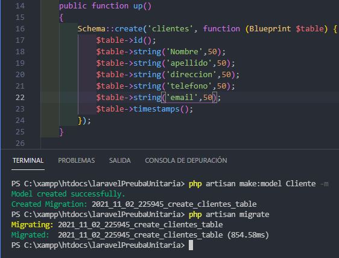
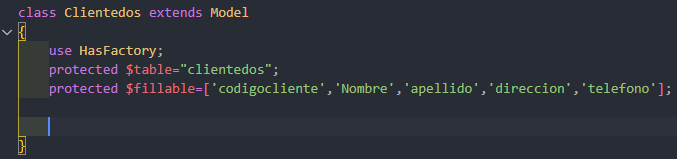
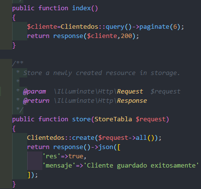
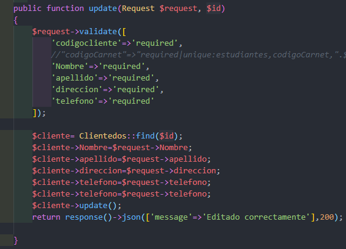
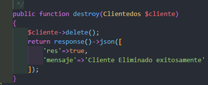
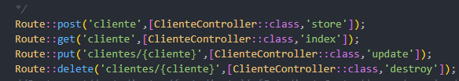
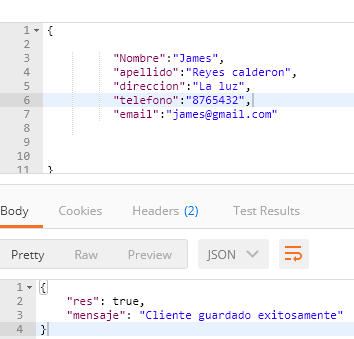

## pruebas en laravel para probar la API

Teniendo en cuenta que ya hemos creado el proyecto de laravel y la conexion  con la base de datos lo primero que hacemos es la crear la tabla de la base  de datos usando el comando de "php artisan  make:model Cliente -m" con este  comando tambien nos genera el model, podemos ver en la captura el resultado.

Posteriormete buscamos la carpeta de models y seleccionamos el archivo que nos creo  que se llama "Cliente" usamos una variable para pasarle el nombre de la tabla de tipo  protegido y despues los datos que contiene ella, esto lo utilizaremos para registrar datos. 

Despues creamos un controller este se crea con el comando "php artisan make:controller  ClienteController --resource" y listo, despues dentro del archivo encontraremos las  funciones que tiene un crud que son la que usamos, en la de index solo importamos la clase  cliente models y la retornamos en response para que nos devuelva el resultado, en el caso  de la funcion de store esta usamos consulta request donde en un archivo de ahi ingresamos los  campos que necesitamos y que sean de tipo requerido y aqui solo lo importamos, luego  instanciamos el models y le pasamos la fuuncionalidad create de tipo request en caso que este  todo bien nos mandara el mensaje que esta guardado correctamente. 

Aqui en la funcion de update lo hice de una forma directa ya que usando request me presentaba un  error, aqui lo hicimos de una forma directa, es decir todo lo hicimos aqui mismo, es decir las validaciones  requeridas, luego instanciamos la Clase del model que es cliente le pasamos el id en caso que todo se  cumpla se editara correctamente, para destroy que es eliminar es sencillo solo instanciamos a cliente le  paasamos la funcion delete y por ultimo que nos retorne un mensaje que se elimino. 

Despues buscamos en la carpeta Routes seleccionamos el archivo de api y creamos las rutas  a como podemos ver la imagen, para evitar cualquier erro, tenemos que importar la ruta del  clienteController y listo podemos ejecutar.

Por ultimo, despues de ejecutar nos dirigimos hacia postman y nos llevamos la ruta  o direccion de store que es para ingresar, la colocamos en la parte superior, despues  Agregamos los campos y lo que vamos ingresar en cada campo en formato json,  ejecutamos y obtenemos el resultado en este caso todo bien. 

Ahora estando en postman habrimos otra venta,ingresamos la ruta o direccion de update  que es para editar, la colocamos en la parte superior y le pasamos el id del cliente que  deseamos editar, despues Agregamos los campos y lo que vamos editar en cada campo  en formato json, ejecutamos y obtenemos el resultado en este caso todo bien. 

Y para finalizar el delete este es para eliminar, aqui al igual que editar le pasamos la ruta con su id  especifico pero para eliminarlo damos ejecutar y listo, tenemos resultado correcto. 

